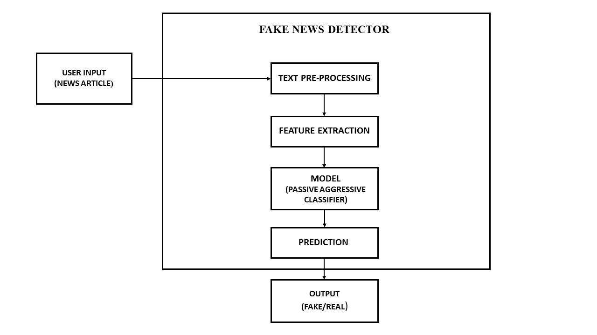

# 📰 Fake News Detection using Machine Learning  

---

## 📚 Table of Contents
- [✨ Introduction](#-introduction)  
- [❓ Problem Definition](#-problem-definition)  
- [🛠 Project Structure](#-project-structure)  
- [📊 Datasets](#-datasets)  
- [🧠 Model](#-model)  
- [📸 Images](#-images)  
- [⚙️ Prerequisites](#️-prerequisites)  
- [🚀 Getting Started](#-getting-started)  

---

## ✨ Introduction  
This repository showcases a **complete end-to-end Fake News Detection system** leveraging **Machine Learning (ML)** and **Natural Language Processing (NLP)**.  

- Real-time prediction of news authenticity  
- Deployed as a **Flask Web App** with interactive UI  
- **96% accuracy** using **Passive Aggressive Classifier (PAC)**  
- Clear visualization of workflow via diagrams and confusion matrix  

---

## ❓ Problem Definition  
The spread of **misinformation and fake news** is a major challenge in today’s digital world 🌐.  
This project addresses it by:  
- Identifying **unreliable news sources** based on multiple articles  
- Reducing misclassification errors through **source-based prediction**  
- Empowering **social media platforms** to apply visibility weights and **reduce fake content reach**  

---
## 🛠 Project Structure  
Organized for **clarity and scalability**:  

Fake-News-Detection/
│
├── dataset/ # Train & Test CSV files (Kaggle dataset)
├── templates/ # HTML pages (Home, Prediction)
├── static/ # CSS, Images, JavaScript
├── Images/ # Project visuals (Block Diagram, Confusion Matrix)
├── Fake_News_Detector-PA.ipynb # Jupyter Notebook (model training & evaluation)
├── model.pkl # Pre-trained PAC model
├── vector.pkl # TF-IDF vectorizer
├── app.py # Flask web application
└── README.md # Documentation

---
## 📊 Datasets  
Sourced from [Kaggle Fake News Dataset](https://www.kaggle.com/c/fake-news).  

### **train.csv**
- `id`: Unique article identifier  
- `title`: Headline of the article  
- `author`: Author name  
- `text`: Full article content (may be partial)  
- `label`:  
  - `0` → Real News ✅  
  - `1` → Fake News ❌  

### **test.csv**
- Same structure as `train.csv` but without `label` (for prediction).  

---
## 🧠 Model  

### **Model Used: Passive Aggressive Classifier (PAC)**  
- **Why PAC?**
  - Suited for **large-scale online learning** (real-time updates)  
  - Efficient binary classification (Fake vs Real)  
  - Works exceptionally well with **sparse TF-IDF data**  

### **Performance**
- Achieved **96% Accuracy**  
- Evaluated using **Confusion Matrix** and **Classification Report**  

---

## 📸 Images

<p align="center">
  <b>Block Diagram</b><br>
  
</p>

<p align="center">
  <b>Process Flow Diagram</b><br>
  
</p>

<p align="center">
  <b>Confusion Matrix</b><br>
  
</p>

---

## ⚙️ Prerequisites  
- Python **3.8 or higher**  
- Libraries: `pandas`, `scikit-learn`, `nltk`, `flask`  
- Install dependencies via `requirements.txt`  

---

## Getting Started
To get started with this project, follow these steps:
1. Clone the repository to your local machine:
   ```bash
   git clone https://github.com/abiek12/Fake-News-Detection-using-MachineLearning.git
   ```

2. Create a virtual environment (optional but recommended):
   ```bash
   python -m venv my_env
   ```

3. Activate the virtual environment:
   ```bash
   # On Windows
   .\my_env\Scripts\Activate.ps1
   # On macOS and Linux
   source my_env/bin/activate
   ```

4. Install project dependencies:
   ```bash
   pip install -r requirements.txt
   ```

5. Run the web application:
   ```bash
   python app.py
   ```

Access the application in your web browser by navigating to `http://localhost:5000`.

---

**Author**
- Aditya Patil ([https://github.com/abiek12](https://github.com/AdityaPatil7900))

- If you have any questions or need further assistance, feel free to contact us at adityapatil0790@gmail.com

---
